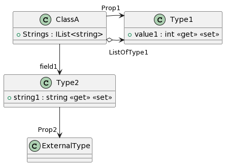

<div align="center">
<strong><a href="README.md">English</a> | <a href="README.zh-CN.md">简体中文</a></strong>
</div>


# PlantUmlClassDiagramGenerator

This is a generator to create a class-diagram of PlantUML from the C# source code.

**README.md Version revision history**

| Version | Commit                                                       | Comment                                                      |
| ------- | ------------------------------------------------------------ | ------------------------------------------------------------ |
| 1.1     | [e73b4fe](https://github.com/pierre3/PlantUmlClassDiagramGenerator/commit/e73b4feed9cd261271eb990a9c859f53536e8d7c) | Add "-excludeUmlBeginEndTags" option |
| 1.0     | [70bb820](https://github.com/pierre3/PlantUmlClassDiagramGenerator/commit/70bb8202f7f489aa2d85ce9c25c58121c8f63aed) | Because the README.md for other languages is not always updated at the same time, a version number is needed |

## Roslyn Source Generator

The class diagram is automatically generated by the Roslyn Source Generator. Details are provided in the link below.

- [PlantUmlClassDiagramGenerator.SourceGenerator](/src/PlantUmlClassDiagramGenerator.SourceGenerator)


## Visual Studio Code Extension

- [C# to PlantUML](https://marketplace.visualstudio.com/items?itemName=pierre3.csharp-to-plantuml)

## .Net Core global tools

Nuget Gallery: https://www.nuget.org/packages/PlantUmlClassDiagramGenerator

### Installation
Download and install the [.NET 8.0 SDK](https://www.microsoft.com/net/download/windows) or newer. Once installed, run the following command.

```bat
dotnet tool install --global PlantUmlClassDiagramGenerator
```
### Usage
Run the "puml-gen" command.

```bat
puml-gen InputPath [OutputPath] [-dir] [-public | -ignore IgnoreAccessibilities] [-excludePaths ExcludePathList] [-createAssociation]
```

- InputPath: (Required) Sets a input source file or directory name.
- OutputPath: (Optional) Sets a output file or directory name.  
  If you omit this option, plantuml files are outputted to same directory as the input files.
- -dir: (Optional) Specify when InputPath and OutputPath are directory names.
- -public: (Optional) If specified, only public accessibility members are output. 
- -ignore: (Optional) Specify the accessibility of members to ignore, with a comma separated list.
- -excludePaths: (Optional) Specify the exclude file and directory.   
  Specifies a relative path from the "InputPath", with a comma separated list.
  To exclude multiple paths, which contain a specific folder name, preceed the name by "\*\*/". Example: "**/bin"
- -createAssociation: (Optional) Create object associations from references of fields and properites.
- -allInOne: (Optional) Only if -dir is set: copy the output of all diagrams to file include.puml (this allows a PlanUMLServer to render it).
- -attributeRequired: (Optional) When this switch is enabled, only types with "PlantUmlDiagramAttribute" in the type declaration will be output.
- -excludeUmlBeginEndTags: (Optional) When this switch is enabled, it will exclude the \"@startuml\" and \"@enduml\" tags from the puml file.

examples
```bat
puml-gen C:\Source\App1\ClassA.cs -public
```

```bat
puml-gen C:\Source\App1 C:\PlantUml\App1 -dir -ignore Private,Protected -createAssociation -allInOne
```

```bat
puml-gen C:\Source\App1 C:\PlantUml\App1 -dir -excludePaths bin,obj,Properties
```

## Specification for conversion to PlantUML

### Type Declaration

#### Type Keywords

|C#               | PlantUML           |
|:----------------|-------------------:|
| `class`         | `class`            |
| `struct`        | `struct`           |
| `interface`     | `interface`        |
| `enum`          | `enum`             |
| `record`        | `<<record>> class` |

#### Type Modifiers

|C#               | PlantUML           |
|:----------------|-------------------:|
| `abstract`       | `abstract`        |
| `static`        | `<<static>>`       |
| `partial`       | `<<partial>>`      |
| `sealed`        | `<<sealed>>`       |

- C#

```cs
class ClassA {  
}
struct StructA {
}
interface InterfaceA {
}
record RecordA {
}
abstract class AbstractClass {
}
static class StaticClass {
}
sealed partial class ClassB{
}
enum EnumType{
  Apple,
  Orange,
  Grape
}
```
- PlantUML

```
@startuml
class ClassA {
}
struct StructA {
}
interface InterfaceA {
}
class RecordA <<record>> {
}
abstract class AbstractClass {
}
class StaticClass <<static>> {
}
class ClassB <<sealed>> <<partial>> {
}
enum EnumType {
    Apple,
    Orange,
    Grape,
}
@enduml
```


#### Generics Type

- C#

```cs
class GenericsType<T1>{
}
class GenericsType<T1,T2>{
}
```
- PlantUML

```
class "GenericsType`1"<T1>{
}
class "GenericsType`2"<T1,T2>{
}
```


### Member Declaration

#### Accessibility Modifiers

|C#                    | PlantUML           |
|:---------------------|-------------------:|
| `public`             | `+`                |
| `internal`           | `<<internal>>`     |
| `protected internal` | `# <<internal>>`   |
| `protected`          | `#`                |
| `private`            | `-`                |

#### Modifiers

|C#            | PlantUML         |
|:-------------|-----------------:|
| `abstract`   | `{abstract}`     |
| `static`     | `{static}`       |
| `virtual`    | `<<virtual>>`    |
| `override`   | `<<override>>`   |
| `new`        | `<<new>>`        |
| `readonly`   | `<<readonly>>`   |
| `event`      | `<<event>>`      |

#### Property Accessors

|C#                              | PlantUML                            |
|:-------------------------------|------------------------------------:|
| `int Prop {get; set;}`         | `Prop : int <<get>> <<set>>`        |
| `int Prop {get;}`              | `Prop : int <get>`                  |
| `int Prop {get; private set }` | `Prop : int <<get>><<private set>>` |
| `int Prop => 100;`             | `Prop : int <<get>>`                |

- C#

```cs
abstract class AbstractClass
{
    protected int _x;
    internal int _y;
    protected internal int _z;
    public abstract void AbstractMethod();
    protected virtual void VirtualMethod(string s){

    }
    public string BaseMethod(int n){
        return "";
    }
}
class ClassM : AbstractClass
{
    public static readonly double PI =3.141592;
    public int PropA { get; set; }
    public int PropB { get; protected set; }
    public event EventHandler SomeEvent;
    public override void AbstractMethod(){
        
    }
    protected override void VirtualMethod(string s)
    {

    }
    public override string ToString()
    {
        return "override";
    }
    public new string BaseMethod(int n){
        return "new";
    }
}
```

- PlantUML

```
abstract class AbstractClass {
    # _x : int
    <<internal>> _y : int
    # <<internal>> _z : int
    + {abstract} AbstractMethod() : void
    # <<virtual>> VirtualMethod(s:string) : void
    + BaseMethod(n:int) : string
}
class ClassM {
    + {static} <<readonly>> PI : double = 3.141592
    + PropA : int <<get>> <<set>>
    + PropB : int <<get>> <<protected set>>
    +  <<event>> SomeEvent : EventHandler 
    + <<override>> AbstractMethod() : void
    # <<override>> VirtualMethod(s:string) : void
    + <<override>> ToString() : string
    + <<new>> BaseMethod(n:int) : string
}
AbstractClass <|-- ClassM
```


#### Field and Property Initializers

Only __literal__ initializers are output.

- C#

```cs
class ClassC
{
    private int fieldA = 123;
    public double Pi {get;} = 3.14159;
    protected List<string> Items = new List<string>(); 
}
```

- PlantUML

```
class ClassC {
  - fieldA : int = 123
  + Pi : double = 3.14159
  # Items : List<string>
}
```


### Nested Class Declaration

Nested classes are expanded and associated with "OuterClass + - InnerClass".

- C#

```cs
class OuterClass 
{
  class InnerClass 
  {
    struct InnerStruct 
    {

    }
  }
}
```

- PlantUML

```
class OuterClass{

}
class InnerClass{

}
<<struct>> class InnerStruct {

}
OuterClass +- InnerClass
InnerClass +- InnerStruct
```


### Inheritance Relationsips

- C#

```cs
abstract class BaseClass
{
    public abstract void AbstractMethod();
    protected virtual int VirtualMethod(string s) => 0;
}
class SubClass : BaseClass
{
    public override void AbstractMethod() { }
    protected override int VirtualMethod(string s) => 1;
}

interface IInterfaceA {}
interface IInterfaceA<T>:IInterfaceA
{
    T Value { get; }
}
class ImplementClass : IInterfaceA<int>
{
    public int Value { get; }
}
```

- PlantUML

```
abstract class BaseClass {
    + {abstract} AbstractMethod() : void
    # <<virtual>> VirtualMethod(s:string) : int
}
class SubClass {
    + <<override>> AbstractMethod() : void
    # <<override>> VirtualMethod(s:string) : int
}
interface IInterfaceA {
}
interface "IInterfaceA`1"<T> {
    Value : T <<get>>
}
class ImplementClass {
    + Value : int <<get>>
}
BaseClass <|-- SubClass
IInterfaceA <|-- "IInterfaceA`1"
"IInterfaceA`1" "<int>" <|-- ImplementClass
```


### Associations (from references of fields and properties)

If you specify the "createAssociation" option, object associations is created from field and property references.

- C#

```cs
class ClassA{
    public IList<string> Strings{get;} = new List<string>();
    public Type1 Prop1{get;set;}
    public Type2 field1;
}

class Type1 {
    public int value1{get;set;}
}

class Type2{
    public string string1{get;set;}
    public ExternalType Prop2 {get;set;}
}
```

- PlantUML

```
@startuml
class ClassA {
}
class Type1 {
    + value1 : int <<get>> <<set>>
}
class Type2 {
    + string1 : string <<get>> <<set>>
}
class "IList`1"<T> {
}
ClassA o-> "Strings<string>" "IList`1"
ClassA --> "Prop1" Type1
ClassA --> "field1" Type2
Type2 --> "Prop2" ExternalType
@enduml
```




### Record types (with parameter list)

Record types in C# 9 can have a parameter list. In these cases these parameters
are added as properties to the class.


- C#

```cs
record Person(string Name, int Age);

record Group(string GroupName) {
    public Person[] Members { get; init; }
}
```

- PlantUML

```
@startuml
class Person <<record>> {
    + Name : string <<get>> <<init>>
    + Age : int <<get>> <<init>>
}
class Group <<record>> {
    + GroupName : string <<get>> <<init>>
    + Members : Person[] <<get>> <<init>>
}
@enduml
```


## Attribute-based configuration

You can add the package [PlantUmlClassDiagramGenerator.Attributes](https://www.nuget.org/packages/PlantUmlClassDiagramGenerator.Attributes) to your C# project for attribute-based configuration.

### PlantUmlDiagramAttribute
Only types to which PlantUmlDiagramAttribute has been added will be output.
This attribute is enabled if the -attributeRequired switch is added to the command line argument.

This attribute can be added only to type declalerations.
- class
- struct
- enum
- record

```cs
class ClassA
{
    public string Name { get; set; }
    public int Age { get; set; }
}

[PlantUmlDiagram]
class ClassB
{
    public string Name { get; set; }
    public int Age { get; set; }
}
```

Only ClassB with PlantUmlDiagramAttribute will be output.

```
@startuml
class ClassB {
    + Name : string <<get>> <<set>>
    + Age : int <<get>> <<set>>
}
@enduml
```


### PlantUmlIgnoreAttribute
Elements with this attribute added are excluded from the output.

```cs
[PlantUmlIgnore]
class ClassA
{
    public string Name { get; set; }
    public int Age { get; set; }
}

class ClassB
{
    public string Name { get; set; }
    [PlantUmlIgnore]
    public int Age { get; set; }
}

class ClassC
{
    public string Name { get; set; }
    public int Age { get; set; }

    [PlantUmlIgnore]
    public ClassC(string name, int age) => (Name, Age) = (name, age);
    
    public void MethodA();
    
    [PlantUmlIgnore]
    public void MethodB();
}
```

```
@startuml
class ClassB {
    + Name : string
}
class ClassC {
    + Name : string
    + Age : int
    + MethodA() : void
}
@enduml
```

### PlantUmlAssociationAttribute
By adding this attribute, you can define association between classes.
This attribute can be added to properties, fields and method parameters.

The details of the association are defined in the following properties.

- _Name_
  - Specifies the type name on the leaf node side.
  - If omitted, the name of the element to which the attribute is added is used.
- _Association_
  - Specifies the edge portion of the association.Sets a valid string in PlantUML.
  - If omitted, "--" is used.
- _RootLabel_
  - Specifies the label to be displayed on the root node side.
  - If omitted, nothing is displayed. 
- _Label_
  - Specifies the label to be displayed in the center of the edge.
  - If omitted, nothing is displayed. 
- _LeafLabel_ 
  - Specifies the label to be displayed on the leaf node side.
  - If omitted, nothing is displayed.  

```cs
class Parameters
{
    public string A { get; set; }
    public string B { get; set; }
}

class CustomAssociationSample
{
    [PlantUmlAssociation(Name = "Name", Association = "*-->", LeafLabel = "LeafLabel", Label= "Label", RootLabel = "RootLabel")] 
    public ClassA A { get; set; }
}

class CollectionItemsSample
{
    [PlantUmlAssociation(Name = "Item", Association = "o--", LeafLabel = "0..*", Label = "Items")]
    public IList<Item> Items { get; set; }
}

class MethodParamtersSample
{
    public void Run([PlantUmlAssociation(Association = "..>", Label = "use")] Parameters p)
    {
        Console.WriteLine($"{p.A},{p.B}");
    }

    private ILogger logger;
    public MyClass([PlantUmlAssociation(Association = "..>", Label = "Injection")] ILogger logger)
    {
        this.logger = logger;
    }
}
```

```
@startuml
class Parameters {
    + A : string <<get>> <<set>>
    + B : string <<get>> <<set>>
}
class CustomAssociationSample {
}
class CollectionItemsSample {
}
class MethodParamtersSample {
    + Run(p:Parameters) : void
    + MyClass(logger:ILogger)
}
CustomAssociationSample "RootLabel" *--> "LeafLabel" Name : "Label"
CollectionItemsSample o-- "0..*" Item : "Items"
MethodParamtersSample ..> Parameters : "use"
MethodParamtersSample ..> ILogger : "Injection"
@enduml
```


### PlantUmlIgnoreAssociationAttribute

This attribute can be added to properties and fields.
Properties (or fields) with this attribute are described as members of the class without any association.

```cs
class User
{
    public string Name { get; set; }
    public int Age { get; set; }
}

class ClassA
{
    public static User DefaultUser { get; }
    public IList<User> Users { get; }

    public ClassA(IList<User> users)
    {
        Users = users;
        DefaultUser = new User()
        {
            Name = "DefaultUser",
            Age = "20"
        };
    }
}

class ClassB
{
    [PlantUmlIgnoreAssociation]
    public static User DefaultUser { get; }

    [PlantUmlIgnoreAssociation]
    public IList<User> Users { get; }

    public ClassB(IList<User> users)
    {
        Users = users;
        DefaultUser = new User()
        {
            Name = "DefaultUser",
            Age = "20"
        };
    }
}
```

```
@startuml
class User {
    + Name : string <<get>> <<set>>
    + Age : int <<get>> <<set>>
}
class ClassA {
    + ClassA(users:IList<User>)
}
class ClassB {
    + {static} DefaultUser : User <<get>>
    + Users : IList<User> <<get>>
    + ClassB(users:IList<User>)
}
class "IList`1"<T> {
}
ClassA --> "DefaultUser" User
ClassA --> "Users<User>" "IList`1"
@enduml
```


